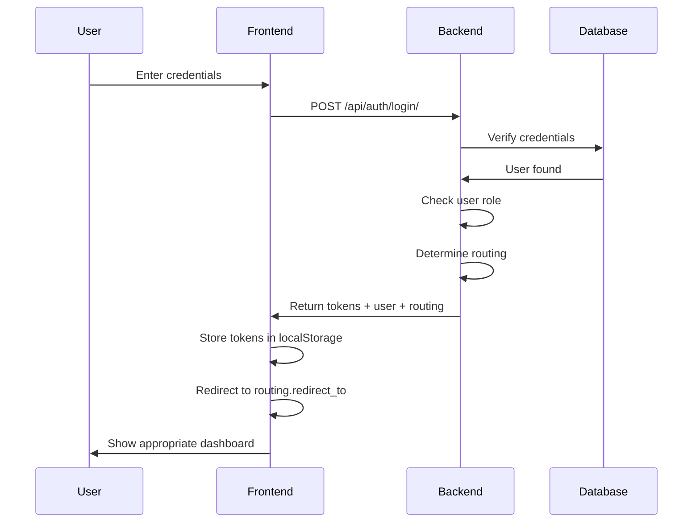

# Unified Login System - Frontend Implementation Guide
## YEA Poultry Management System

**Last Updated:** November 27, 2025  
**Version:** 1.0  
**Purpose:** Single login endpoint with automatic role-based routing

---

## Overview

The system provides **one unified login endpoint** that automatically determines whether the user is a **Farmer** or **Office Staff/Admin** and returns appropriate routing information.

### Key Features

✅ **Single Login Endpoint** - `/api/auth/login/`  
✅ **Automatic Role Detection** - Backend determines user type  
✅ **Routing Information Included** - Response contains redirect path  
✅ **No Frontend Role Logic Needed** - Backend handles all role checks  
✅ **User Information Included** - Full user profile in response

---

## API Endpoint

### POST /api/auth/login/

**URL:** `https://api.example.com/api/auth/login/`

**Method:** `POST`

**Authentication:** None (public endpoint)

**Request Headers:**
```http
Content-Type: application/json
```

**Request Body:**
```json
{
  "username": "user@example.com",
  "password": "password123"
}
```

**Note:** Username can be either username or email address.

---

## Response Format

### Admin/Office Staff Response

When a user with admin role logs in (NATIONAL_ADMIN, REGIONAL_COORDINATOR, CONSTITUENCY_OFFICIAL, EXTENSION_OFFICER, etc.):

```json
{
  "refresh": "eyJhbGciOiJIUzI1NiIsInR5cCI6IkpXVCJ9...",
  "access": "eyJhbGciOiJIUzI1NiIsInR5cCI6IkpXVCJ9...",
  "user": {
    "id": "d5bcd9ba-4eb6-44ed-909a-f7dadabb5e86",
    "username": "adminuser",
    "email": "mikedlt009@gmail.com",
    "phone": "+233241234567",
    "first_name": "YEA",
    "last_name": "Admin",
    "role": "NATIONAL_ADMIN",
    "role_display": "National Administrator",
    "full_name": "YEA Admin",
    "region": null,
    "constituency": null,
    "is_verified": true,
    "is_active": true
  },
  "routing": {
    "dashboard_type": "admin",
    "redirect_to": "/admin/dashboard",
    "is_admin": true,
    "is_farmer": false
  }
}
```

### Farmer Response

When a farmer user logs in:

```json
{
  "refresh": "eyJhbGciOiJIUzI1NiIsInR5cCI6IkpXVCJ9...",
  "access": "eyJhbGciOiJIUzI1NiIsInR5cCI6IkpXVCJ9...",
  "user": {
    "id": "f3515e2b-1715-410e-86cb-925180c20713",
    "username": "testfarmer",
    "email": "testfarmer@example.com",
    "phone": "+233240000000",
    "first_name": "Test",
    "last_name": "Farmer",
    "role": "FARMER",
    "role_display": "Farmer",
    "full_name": "Test Farmer",
    "region": null,
    "constituency": null,
    "is_verified": false,
    "is_active": true
  },
  "routing": {
    "dashboard_type": "farmer",
    "redirect_to": "/farmer/dashboard",
    "is_admin": false,
    "is_farmer": true
  }
}
```

---

## Response Fields Explained

### Tokens
| Field | Type | Description |
|-------|------|-------------|
| `access` | string | JWT access token (expires in 1 hour) |
| `refresh` | string | JWT refresh token (expires in 7 days) |

### User Object
| Field | Type | Description |
|-------|------|-------------|
| `id` | UUID | Unique user identifier |
| `username` | string | User's username |
| `email` | string | User's email address |
| `phone` | string | Phone number (Ghana format) |
| `first_name` | string | First name |
| `last_name` | string | Last name |
| `role` | string | User role (see Role Types below) |
| `role_display` | string | Human-readable role name |
| `full_name` | string | Full name (first + last) |
| `region` | string/null | Assigned region (for admins) |
| `constituency` | string/null | Assigned constituency (for admins) |
| `is_verified` | boolean | Account verification status |
| `is_active` | boolean | Account active status |

### Routing Object
| Field | Type | Description |
|-------|------|-------------|
| `dashboard_type` | string | `"admin"` or `"farmer"` |
| `redirect_to` | string | Frontend route to redirect to |
| `is_admin` | boolean | True if user is office staff/admin |
| `is_farmer` | boolean | True if user is a farmer |

---

## Role Types

### Admin Roles (Office Staff)
These roles redirect to `/admin/dashboard`:

- `SUPER_ADMIN` - System Administrator
- `NATIONAL_ADMIN` - National Administrator (YEA Headquarters)
- `REGIONAL_COORDINATOR` - Regional Coordinator
- `CONSTITUENCY_OFFICIAL` - Constituency Official
- `EXTENSION_OFFICER` - Extension Officer (Field Staff)
- `VETERINARY_OFFICER` - Veterinary Officer
- `PROCUREMENT_OFFICER` - Procurement Officer
- `AUDITOR` - Auditor

### Farmer Role
This role redirects to `/farmer/dashboard`:

- `FARMER` - Poultry Farmer

---

## Frontend Implementation

### React/Next.js Example

```typescript
// types.ts
export interface LoginResponse {
  access: string;
  refresh: string;
  user: {
    id: string;
    username: string;
    email: string;
    phone: string;
    first_name: string;
    last_name: string;
    role: string;
    role_display: string;
    full_name: string;
    region: string | null;
    constituency: string | null;
    is_verified: boolean;
    is_active: boolean;
  };
  routing: {
    dashboard_type: 'admin' | 'farmer';
    redirect_to: string;
    is_admin: boolean;
    is_farmer: boolean;
  };
}

// login.tsx
'use client';

import { useState } from 'react';
import { useRouter } from 'next/navigation';

export default function LoginPage() {
  const router = useRouter();
  const [username, setUsername] = useState('');
  const [password, setPassword] = useState('');
  const [loading, setLoading] = useState(false);
  const [error, setError] = useState('');

  const handleLogin = async (e: React.FormEvent) => {
    e.preventDefault();
    setLoading(true);
    setError('');

    try {
      const response = await fetch('http://localhost:8000/api/auth/login/', {
        method: 'POST',
        headers: {
          'Content-Type': 'application/json',
        },
        body: JSON.stringify({ username, password }),
      });

      if (!response.ok) {
        const errorData = await response.json();
        throw new Error(errorData.detail || 'Login failed');
      }

      const data: LoginResponse = await response.json();

      // Store tokens
      localStorage.setItem('access_token', data.access);
      localStorage.setItem('refresh_token', data.refresh);
      localStorage.setItem('user', JSON.stringify(data.user));
      localStorage.setItem('routing', JSON.stringify(data.routing));

      // Automatic redirect based on user type
      router.push(data.routing.redirect_to);
      
    } catch (err) {
      setError(err instanceof Error ? err.message : 'Login failed');
    } finally {
      setLoading(false);
    }
  };

  return (
    <div className="login-container">
      <div className="login-card">
        <h1>YEA Poultry Management System</h1>
        <p className="subtitle">Login for Farmers and Office Staff</p>

        <form onSubmit={handleLogin}>
          <div className="form-group">
            <label htmlFor="username">Username or Email</label>
            <input
              id="username"
              type="text"
              value={username}
              onChange={(e) => setUsername(e.target.value)}
              placeholder="Enter your username or email"
              required
            />
          </div>

          <div className="form-group">
            <label htmlFor="password">Password</label>
            <input
              id="password"
              type="password"
              value={password}
              onChange={(e) => setPassword(e.target.value)}
              placeholder="Enter your password"
              required
            />
          </div>

          {error && (
            <div className="error-message">
              {error}
            </div>
          )}

          <button
            type="submit"
            className="btn-primary"
            disabled={loading}
          >
            {loading ? 'Logging in...' : 'Login'}
          </button>
        </form>

        <div className="login-info">
          <p>✓ Farmers will be directed to Farmer Dashboard</p>
          <p>✓ Office Staff will be directed to Admin Dashboard</p>
        </div>
      </div>
    </div>
  );
}
```

### Simplified Flow

```typescript
// 1. User enters credentials
const credentials = { username: 'user@example.com', password: 'password123' };

// 2. Send login request
const response = await fetch('/api/auth/login/', {
  method: 'POST',
  headers: { 'Content-Type': 'application/json' },
  body: JSON.stringify(credentials)
});

const data = await response.json();

// 3. Store tokens and user info
localStorage.setItem('access_token', data.access);
localStorage.setItem('refresh_token', data.refresh);
localStorage.setItem('user', JSON.stringify(data.user));

// 4. Redirect based on routing info
router.push(data.routing.redirect_to);
// Farmers go to: /farmer/dashboard
// Admins go to: /admin/dashboard
```

---

## Error Handling

### Invalid Credentials (401)

```json
{
  "detail": "No active account found with the given credentials"
}
```

### Account Inactive (401)

```json
{
  "detail": "User account is disabled"
}
```

### Missing Fields (400)

```json
{
  "username": ["This field is required."],
  "password": ["This field is required."]
}
```

### Example Error Handling

```typescript
try {
  const response = await fetch('/api/auth/login/', {
    method: 'POST',
    headers: { 'Content-Type': 'application/json' },
    body: JSON.stringify({ username, password })
  });

  if (!response.ok) {
    const error = await response.json();
    
    if (response.status === 401) {
      setError('Invalid username or password');
    } else if (response.status === 400) {
      setError('Please fill in all fields');
    } else {
      setError('Login failed. Please try again.');
    }
    return;
  }

  const data = await response.json();
  // Success - proceed with redirect
  
} catch (error) {
  setError('Network error. Please check your connection.');
}
```

---

## Token Management

### Access Token
- **Lifetime:** 1 hour
- **Usage:** Include in `Authorization` header for all API requests
- **Format:** `Authorization: Bearer <access_token>`

### Refresh Token
- **Lifetime:** 7 days
- **Usage:** Obtain new access token when expired
- **Endpoint:** `POST /api/auth/token/refresh/`

### Token Refresh Example

```typescript
async function refreshAccessToken() {
  const refreshToken = localStorage.getItem('refresh_token');
  
  const response = await fetch('/api/auth/token/refresh/', {
    method: 'POST',
    headers: { 'Content-Type': 'application/json' },
    body: JSON.stringify({ refresh: refreshToken })
  });

  if (!response.ok) {
    // Refresh token expired - redirect to login
    localStorage.clear();
    router.push('/login');
    return null;
  }

  const data = await response.json();
  localStorage.setItem('access_token', data.access);
  return data.access;
}
```

---

## Protected Routes

### Check User Type in Layout

```typescript
'use client';

import { useEffect } from 'react';
import { useRouter } from 'next/navigation';

export default function AdminLayout({ children }) {
  const router = useRouter();

  useEffect(() => {
    const user = localStorage.getItem('user');
    
    if (!user) {
      router.push('/login');
      return;
    }

    const userData = JSON.parse(user);
    const routing = JSON.parse(localStorage.getItem('routing') || '{}');

    // Verify user should be on admin dashboard
    if (!routing.is_admin) {
      router.push('/farmer/dashboard');
    }
  }, [router]);

  return <>{children}</>;
}
```

---

## Testing

### Test Credentials

**Admin User (YEA Office Staff):**
- Username: `adminuser`
- Password: `testuser123`
- Expected redirect: `/admin/dashboard`
- Role: `NATIONAL_ADMIN`

**Farmer User:**
- Username: `testfarmer`
- Password: `farmer123`
- Expected redirect: `/farmer/dashboard`
- Role: `FARMER`

### Test Scenarios

1. ✅ Admin login redirects to `/admin/dashboard`
2. ✅ Farmer login redirects to `/farmer/dashboard`
3. ✅ Invalid credentials show error message
4. ✅ Tokens stored in localStorage
5. ✅ User info available for profile display
6. ✅ Routing info used for navigation

---

## Login Page UI Recommendations

### Single Login Form

**Do:**
- ✅ Use one login form for all users
- ✅ Show "Login for Farmers and Office Staff"
- ✅ Accept username OR email
- ✅ Display loading state during login
- ✅ Show clear error messages
- ✅ Auto-redirect after successful login

**Don't:**
- ❌ Don't create separate login pages for farmers vs admins
- ❌ Don't ask user to select their role
- ❌ Don't show role-specific UI before login
- ❌ Don't manually check roles in frontend

### Example UI Copy

**Page Title:** "YEA Poultry Management System"

**Subtitle:** "Login for Farmers and Office Staff"

**Info Text:**
- "Farmers will be directed to their farm dashboard"
- "Office staff will be directed to admin dashboard"

**Button:** "Login"

---

## Complete API Workflow



---

## FAQ

### Q: Do I need separate login pages?
**A:** No. Use one login page for everyone. The backend determines where to redirect.

### Q: How do I know if a user is admin or farmer?
**A:** Check `response.routing.is_admin` or `response.routing.is_farmer` from the login response.

### Q: Can I use email instead of username?
**A:** Yes. The backend accepts both username and email in the `username` field.

### Q: What if a user has multiple roles?
**A:** Each user has exactly one primary role. The backend uses this role to determine the correct dashboard.

### Q: How do I protect routes?
**A:** Check localStorage for tokens and verify `routing.is_admin` matches the current route type (admin vs farmer).

### Q: What happens when tokens expire?
**A:** Access token expires after 1 hour. Use the refresh token to get a new one. Refresh token expires after 7 days - then user must login again.

---

## Support

**Backend Team Contact:**
- API Issues: Check network requests and token format
- Permission Issues: Review user's role and routing response
- Token Issues: Verify token storage and refresh logic

**Frontend Implementation:**
- Review this guide for complete examples
- Test with provided test credentials
- Ensure proper error handling for all cases

---

**Status:** ✅ Production Ready  
**Tested:** ✅ Admin and Farmer routing verified  
**Documentation:** ✅ Complete
